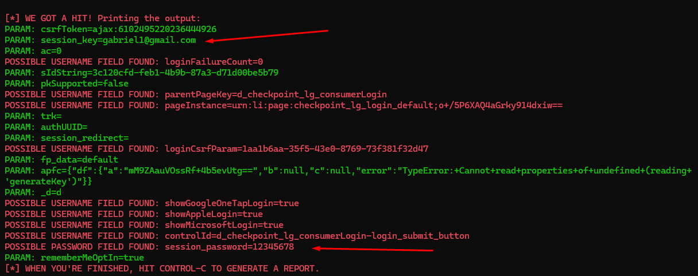

# Desafio de Criação de Phishing com Kali Linux e SEToolkit

## Descrição do Projeto
Este repositório documenta um desafio de segurança cibernética onde foi criada uma simulação de phishing utilizando o Kali Linux e a ferramenta SEToolkit (Social-Engineer Toolkit). O objetivo do projeto foi clonar o site do LinkedIn para demonstrar como ataques de phishing podem ser utilizados para coletar informações de credenciais, enfatizando a importância da conscientização em segurança digital.

> **Aviso Legal:**
> Este projeto foi desenvolvido estritamente para fins educativos e para conscientização sobre vulnerabilidades em segurança cibernética. O uso inadequado das informações ou ferramentas apresentadas neste repositório é estritamente proibido. Sempre tenha a permissão explícita do alvo antes de realizar testes de segurança.

## Funcionalidades
- Uso do Kali Linux como ambiente principal.
- Configuração do SEToolkit para realizar a clonagem de páginas da web.
- Simulação de coleta de credenciais com base no site clonado do LinkedIn.
- Abordagem prática para ensinar sobre vetores de ataque comuns de engenharia social.

## Pré-Requisitos
- Sistema operacional baseado em Kali Linux.
- Ferramenta SEToolkit instalada e configurada.
- Conhecimentos básicos sobre redes e segurança cibernética.

## Passos Realizados
1. **Configuração do ambiente Kali Linux:** Instalação e preparação do sistema operacional para operações de phishing.
2. **Uso do SEToolkit:** Ferramenta utilizada para clonar a página oficial do LinkedIn.
3. **Configuração de um servidor web:** Hospedagem do site clonado para simular o ataque.
4. **Testes controlados:** Realização de testes para coleta de credenciais em um ambiente seguro e monitorado.

## Conclusão
Este projeto destaca a facilidade com que ataques de phishing podem ser configurados e reforça a necessidade de medidas de segurança como:
- Autenticação de dois fatores (2FA);
- Análise cuidadosa de URLs;
- Educação em segurança para usuários finais.

## Nota
Por motivos éticos, este repositório não inclui dados reais ou informações sensíveis. Todo o conteúdo foi projetado para fins educacionais e para promover boas práticas em segurança cibernética.

---

Sinta-se à vontade para explorar o repositório, fazer contribuições e compartilhar conhecimentos para fortalecer a segurança digital!

# Phishing para captura de senhas do Linkedin

### Ferramentas

- Kali Linux
- setoolkit

### Configurando o Phishing no Kali Linux

- Acesso root: ``` sudo su ```
- Iniciando o setoolkit: ``` setoolkit ```
- Tipo de ataque: ``` Social-Engineering Attacks ```
- Vetor de ataque: ``` Web Site Attack Vectors ```
- Método de ataque: ```Credential Harvester Attack Method ```
- Método de ataque: ``` Site Cloner ```
- Obtendo o endereço da máquina: ``` ifconfig ```
- URL para clone: https://www.linkedin.com/login

### Resutados


